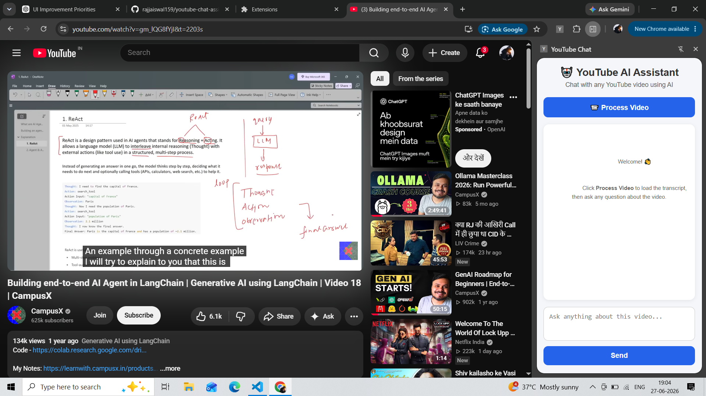
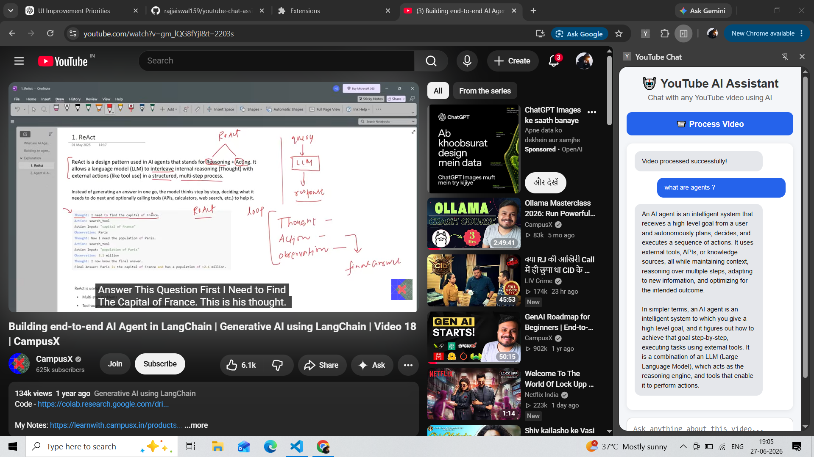

# 🎥 YouTube Video Summarizer & Chat (RAG)

A Retrieval-Augmented Generation (RAG) application built with **LangChain**, **Google Gemini**, **FAISS**, and **Streamlit** that allows users to chat with any YouTube video using its transcript.

Users simply provide a YouTube URL, and the application extracts the transcript, creates vector embeddings, stores them in a FAISS vector database, and answers questions using Google's Gemini LLM.

---

## 🚀 Features

- Extract transcript from YouTube videos
- Split transcript into semantic chunks
- Generate embeddings using Google Gemini
- Store embeddings in FAISS Vector Store
- Retrieval-Augmented Generation (RAG)
- Interactive Streamlit UI
- LCEL (LangChain Expression Language) based chain
- Error handling for common failures
- Modular project structure

---

## 🛠️ Tech Stack

- Python
- LangChain
- Google Gemini API
- Google Generative AI Embeddings
- FAISS
- Streamlit
- YouTube Transcript API
- python-dotenv

---

## 📂 Project Structure

```
youtube-summarizer-chat/
│
├── images/
│   ├── home.png           # Home page screenshot
│   └── chat.png           # Chat interface screenshot
│
├── src/
│   ├── chatbot.py         # RAG chain and chatbot logic
│   ├── text_splitter.py   # Transcript chunking
│   ├── transcript.py      # YouTube transcript extraction
│   └── vectorstore.py     # FAISS vector database
│
├── app.py                 # Streamlit application
├── requirements.txt       # Python dependencies
├── .gitignore             # Git ignore rules
└── README.md              # Project documentation
```

## ⚙️ Installation

### Clone the repository

```bash
git clone https://github.com/rajjaiswal159/youtube-summarizer-chat.git

cd youtube-summarizer-chat
```

---

### Create Virtual Environment

Windows

```bash
python -m venv venv

venv\Scripts\activate
```

Linux / macOS

```bash
python3 -m venv venv

source venv/bin/activate
```

---

### Install Dependencies

```bash
pip install -r requirements.txt
```

---

## 🔑 Environment Variables

Create a `.env` file in the project root.

```
GOOGLE_API_KEY=your_google_api_key
```

---

## ▶️ Run the Application

```bash
streamlit run app.py
```

---

## 🧠 How It Works

1. User enters a YouTube video URL.
2. Transcript is extracted using YouTube Transcript API.
3. Transcript is split into smaller chunks.
4. Google Gemini Embeddings generate vector representations.
5. FAISS stores the embeddings.
6. Relevant chunks are retrieved based on the user's query.
7. Gemini LLM generates the final answer using retrieved context.

---

## 📸 Application Workflow

```
YouTube URL
      │
      ▼
Transcript Extraction
      │
      ▼
Text Splitting
      │
      ▼
Embeddings (Gemini)
      │
      ▼
FAISS Vector Store
      │
      ▼
Retriever
      │
      ▼
Gemini LLM
      │
      ▼
Answer
```
---


## 📸 Screenshots

# 📸 Home Page



---

# 💬 Chat Interface



---


## ⚠️ Error Handling

The application gracefully handles:

- Invalid YouTube URLs
- Transcript unavailable
- Empty user questions
- Missing API key
- API request failures
- Empty transcript
- Unexpected runtime errors

---


## 🔮 Future Improvements

- Chat Memory
- Streaming Responses
- Source Citations
- Multi-video Chat
- Chrome Extension
- Docker Support
- Deployment on Streamlit Cloud

---

## 🤝 Contributing

Contributions are welcome.

Feel free to fork the repository and submit a pull request.

---

## 📄 License

This project is licensed under the MIT License.

---

## 👨‍💻 Author

**Raj Jaiswal**

B.Tech Computer Science Engineering

Aspiring Data Scientist & Machine Learning Engineer